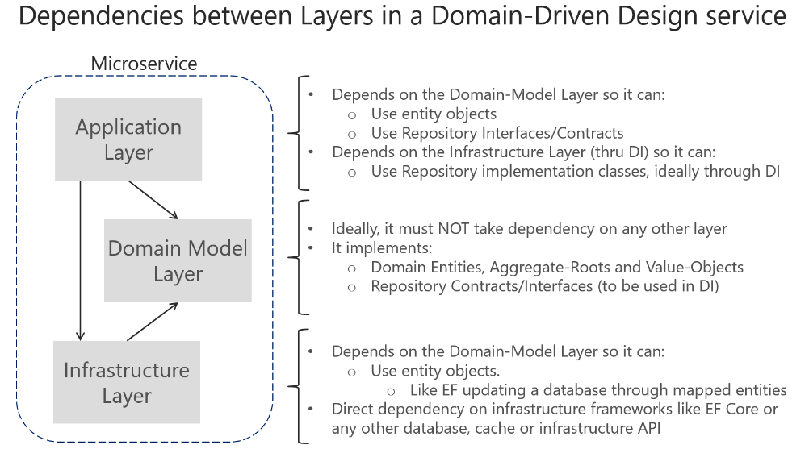
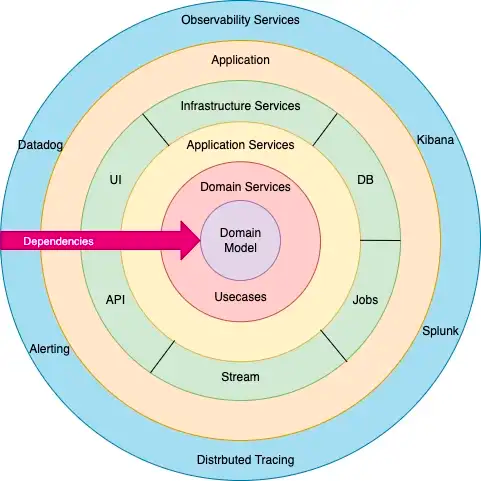
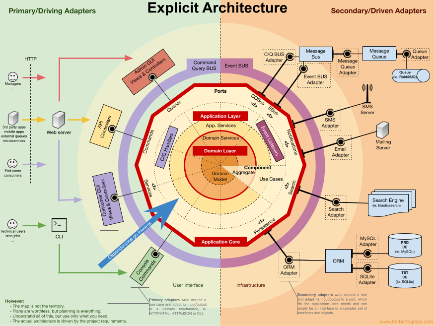
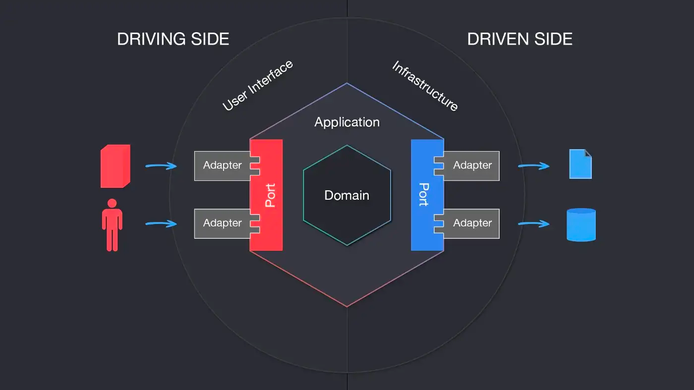
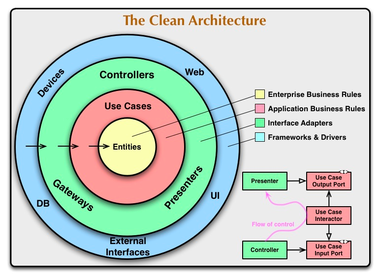
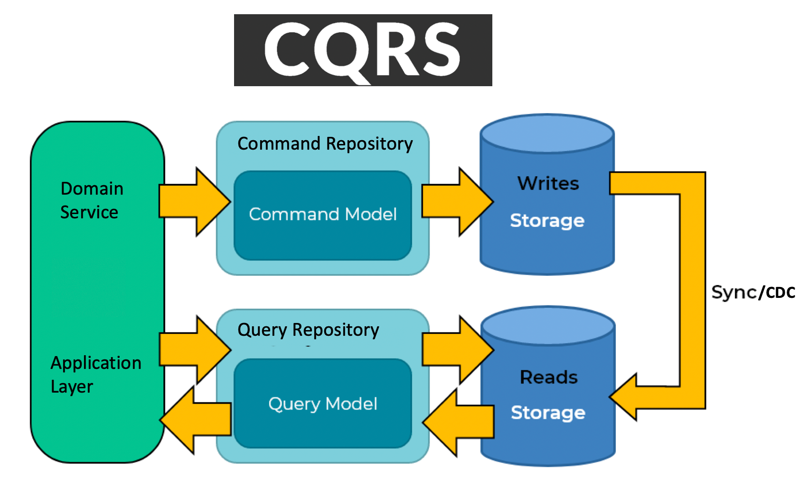
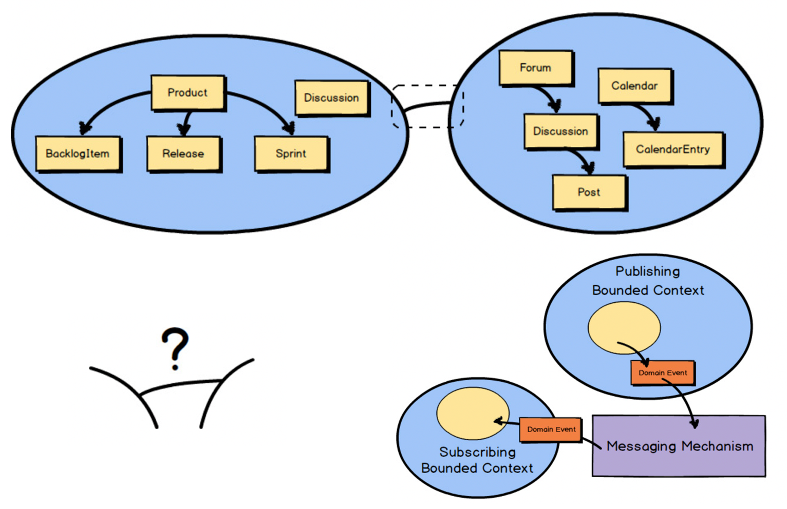

Template DDD project structure
==============================================

A project shows standard structure of Domain Driven Design project with Spring Boot.

# Why DDD?

* Business processes is a complex subject
* Software development is complicated
* Goal of DDD is to manage complexity

# Domain Driven Design Architecture

# Domain Driven Design Layers - Onion Architecture

# Hexagonal (Ports & Adapters) Architecture with DDD

Please consider to adopt Hexagonal Architecture for DDD application layer, example packages as following:

* web package: Web application with templates
* rest package: HTTP REST API
* graphql package: GraphQL API
* grpc package: gRPC API
* rsocket package: RSocket API
* facade package: Facade API for other domains
* common package: Common API for other ports

# Clean Architecture

# CQRS(Command Query Responsibility Separation) Pattern - Write and Read Separation

Please consider to adopt CQRS Pattern for DDD Repository design.

Database Scaling Patterns:

* Scaling for reads: read replication
* Scaling for writes: sharding

Use cases:

* CMS: Content Management System
* E-Commerce: Item detail

# Specification Design Pattern

Specification design pattern allows us to check whether our objects meet certain requirements.
Through this design pattern, we can reuse expression specifications and combine those specifications to easily question whether more complex requirements are satisfied or not.

Specification design pattern is very important for DDD to validate domain objects and some business rules.

# Reactive DDD - communication between bounded contexts

* Async vs Sync
* Message Driven & Back Pressure
* Reactive(RSocket) protocols: Request/Response, Request/Stream, Fire & Forget, Channel
* Reactive Stream Frameworks: Reactor(Mono,Flux), RxJava, Akka Streams, Smallrye Mutiny, Kotlin Flow
* RSocket prefer

# DDD with CQRS, Hexagonal Architecture, Reactive

* DDD Repository: CQRS
* DDD Application and Infrastructure Layers: Hexagonal Architecture
* DDD Event/Communication: Reactive
* DDD Factory: Design Pattern

# Features

* Project directory/package structure
* Validation with specification
* Exception with error package: [Spring 6 ProblemDetail](https://docs.spring.io/spring-framework/docs/current/javadoc-api/org/springframework/http/ProblemDetail.html) integration
* Annotations with jMolecules
* DDD application layer with Hexagonal architecture
* Event firing/listener with Spring Events - `ApplicationEventPublisher`, `@EventListener` and `ApplicationListener`.
* ArchUnit integrated
* Specification Design Pattern

# Requirements

* Java 17
* Apache Maven 3.5+

# Tips

* DTO(Data Transfer Object): please use record instead of class - https://blog.sebastian-daschner.com/entries/java-records
* Please consider Observability into your architecture: Logging, Metrics, Tracing, Events.

# References
          
* Free Domain-Driven Design Learning Resources: https://github.com/ddd-crew/free-ddd-learning-resources
* ddd-crew: https://github.com/ddd-crew
* jMolecules: https://github.com/xmolecules/jmolecules
* Architecturally evident Java applications with jMolecules: https://www.youtube.com/watch?v=IzLHmPNmLLw
* Hexagonal architecture: https://alistair.cockburn.us/hexagonal-architecture/
* CQRS: https://martinfowler.com/bliki/CQRS.html
* Spring Modulith: https://spring.io/projects/spring-modulith
* ArchUnit: https://www.archunit.org/
* Cargo Tracker: https://eclipse-ee4j.github.io/cargotracker/
* jMolecules with Spring Data: https://spring.io/blog/2021/04/20/what-s-new-in-spring-data-2021-0#jmolecules
* Architecturally evident Java applications with jMolecules: https://www.youtube.com/watch?v=IzLHmPNmLLw
* Hexagonal (Ports & Adapters) Architecture: https://medium.com/idealo-tech-blog/hexagonal-ports-adapters-architecture-e3617bcf00a0
* DDD, Hexagonal, Onion, Clean, CQRS, … How I put it all
  together: https://herbertograca.com/2017/11/16/explicit-architecture-01-ddd-hexagonal-onion-clean-cqrs-how-i-put-it-all-together/
* Spring Events: https://www.baeldung.com/spring-events
* Hexagonal Architecture, there are always two sides to every story: https://medium.com/ssense-tech/hexagonal-architecture-there-are-always-two-sides-to-every-story-bc0780ed7d9c
* Understanding Onion Architecture: https://www.codeguru.com/csharp/understanding-onion-architecture/
* Onion Architecture: https://medium.com/expedia-group-tech/onion-architecture-deed8a554423
* Domain-Driven Instead of Technology-Based Project Structure: https://medium.com/@f.s.a.kuzman/domain-driven-instead-of-technology-based-project-structure-db3b34c3fd2d
* A practical simple introduction to DDD: https://levelup.gitconnected.com/a-practical-simple-introduction-to-ddd-cd4a104c8634
* Specification Design Pattern: https://medium.com/c-sharp-progarmming/specification-design-pattern-c814649be0ef
* Specifications by Eric Evans and Martin Fowler: https://martinfowler.com/apsupp/spec.pdf
* One-Stop Guide to Mapping with MapStruct: https://reflectoring.io/java-mapping-with-mapstruct/
* The best Spring Data JpaRepository: https://vladmihalcea.com/best-spring-data-jparepository/
* spring-ddd-bank: a sample project following Domain Driven Design with Spring Data JPA - https://github.com/christophknabe/spring-ddd-bank
* Domain-Driven Design: Manage Data With Jakarta Data and JNoSQL - https://dzone.com/articles/enhancing-domain-driven-design-with-jakarta-data-a

