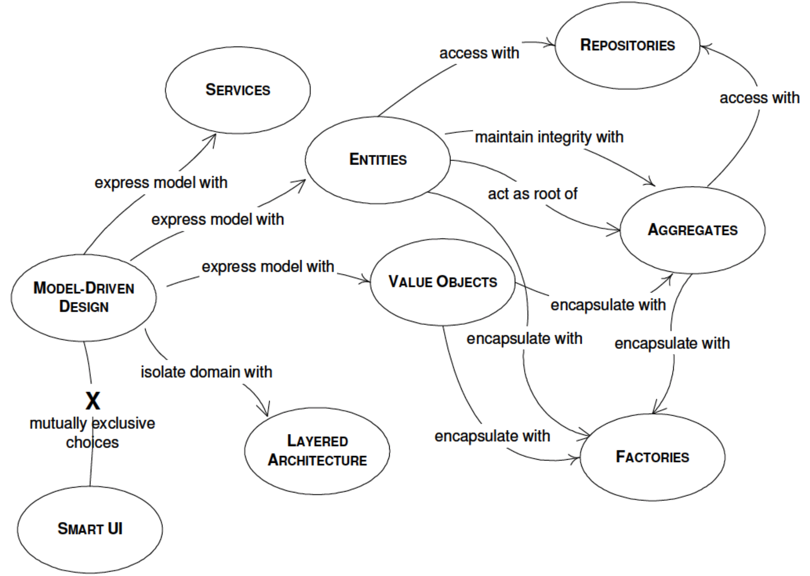

Template DDD project structure with jMolecules
==============================================

A project shows standard structure of Domain Driven Design project with Spring Boot.

# Domain Driven Design Architecture

# Hexagonal (Ports & Adapters) Architecture

# Features

* Project directory/package structure
* Annotations with jMolecules
* DDD application layer with Hexagonal architecture
* Event firing/listener with Spring Events

# References

* jMolecules: https://github.com/xmolecules/jmolecules
* Spring Modulith: https://spring.io/projects/spring-modulith
* Cargo Tracker: https://eclipse-ee4j.github.io/cargotracker/
* jMolecules with Spring Data: https://spring.io/blog/2021/04/20/what-s-new-in-spring-data-2021-0#jmolecules
* Architecturally evident Java applications with jMolecules: https://www.youtube.com/watch?v=IzLHmPNmLLw
* Hexagonal (Ports & Adapters) Architecture: https://medium.com/idealo-tech-blog/hexagonal-ports-adapters-architecture-e3617bcf00a0
* Spring Events: https://www.baeldung.com/spring-events
